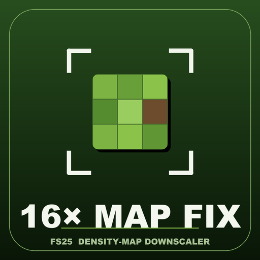

<div align="center">



# FS25 16x Map Fix

**A field-tested tool and investigation notes for `allocReg` failures on large Farming Simulator 25 maps.**

[](LICENSE)

</div>

<div align="center">

</div>

## What was measured

The motivating case was reproduced with the same 16x map on a dedicated server and a 16 GB client.

- The failing client produced **878,987 `allocReg` errors**.
- After the oversized writable density/info layers were reduced to 8192 px by this tool, the tested map produced **0 `allocReg` errors** and joined successfully in multiplayer.
- A dedicated server with **262 GB RAM** still reproduced thousands of `allocReg` errors before the map conversion, which rules out simple server-RAM exhaustion as a sufficient explanation for the multiplayer failure.
- The original, unmodified map could load in the tested single-player setup once enough commit memory was available.

Those are field observations from the tested configurations. The engine-internal explanation below is the interpretation that best fits them; it should not be read as an official GIANTS implementation statement.

## Working diagnosis

Two failure paths can present similarly around the density compilation/loading stage:

| Context | Observed bottleneck | Practical mitigation used here |
|---|---|---|
| **Single player** | high commit-memory demand during first density compilation | sufficient pagefile/commit headroom; DX11 was useful in the tested setup |
| **Multiplayer** | failure scales with oversized writable density maps and persists despite very large server RAM | reduce oversized writable density/info layers to 8192 px |

The multiplayer evidence is consistent with a capacity limit in the path that registers or synchronizes tiled writable density data. Writable crop/ground/info layers cover the full map and scale with map area, unlike read-only assets that can be streamed more selectively.

That interpretation explains why adding server RAM did not fix the reproduced case while reducing the number of writable density tiles did. It remains an inference from behavior and tooling results, not a claim based on GIANTS source code.

## The tool

[`tool/mapfix.py`](tool/mapfix.py) and [`tool/Optimize-Map.bat`](tool/Optimize-Map.bat) convert oversized power-of-two density/info layers to **8192 px** while leaving non-power-of-two height/terrain grids alone.

The workflow is:

```text
map zip
  -> identify oversized writable density/info layers
  -> decode
  -> nearest-neighbour resize
  -> re-encode
  -> write a separate *_fixed.zip
```

The original archive is not modified.

## Use it

1. Install Python 3.
2. Drag the map `.zip` onto `Optimize-Map.bat` on Windows, or run `tool/mapfix.py` directly.
3. Use the generated `*_fixed.zip` on the server.
4. Start a **fresh savegame** so old density-map state is not reused.
5. Keep the original map archive until the converted version has been verified in your own setup.

The tool bundles [`grleconvert`](https://github.com/Paint-a-Farm/grleconvert) under its MIT license for `.gdm`/`.grle` conversion.

## What the conversion changes

The conversion intentionally reduces writable density-map resolution. That trades some underlying density precision for compatibility with the tested large-map multiplayer path.

In the development fixture, decoded/resampled data retained the expected field/crop structure and the converted map was playable. Do not interpret that as a guarantee for every custom map: map authors can use unusual layers, scripts, or assumptions that this tool cannot know about.

**Back up the map and savegame before conversion.**

## Autosave caveat

A separate issue observed on large dedicated-server maps is a visible pause during autosave. A long blocking save can overlap with client timeout behavior even when the server itself remains running.

If that is reproducible in your setup, increasing `auto_save_interval` in `dedicatedServerConfig.xml` can reduce how often the two events coincide. This is separate from the `allocReg` conversion above.

## Related tool

[FS25 Auto VRAM Optimizer](https://github.com/KeilerHirsch/FS25_AutoVRAMOptimizer) adjusts the local texture-streaming budget. It addresses a different rendering/resource constraint and is not required for the density-map conversion.

## Sources and reproducibility

Useful external discussions that motivated or matched the field observations:

- [GIANTS Forum — freezes at 100% compiling shaders on large maps](https://forum.giants-software.com/viewtopic.php?t=217079)
- [GIANTS Forum — Precision Farming and 16x maps](https://forum.giants-software.com/viewtopic.php?t=214384)

If you can reproduce a different outcome, open an issue with the map dimensions, relevant log excerpt, server/client memory configuration, and whether the map was tested before and after conversion. Contradicting evidence is useful here.

## License

Code is [GPLv3](LICENSE). The bundled `grleconvert` binary remains under the upstream MIT license.

The investigation prose in this README may additionally be reused under CC BY 4.0 with attribution.
